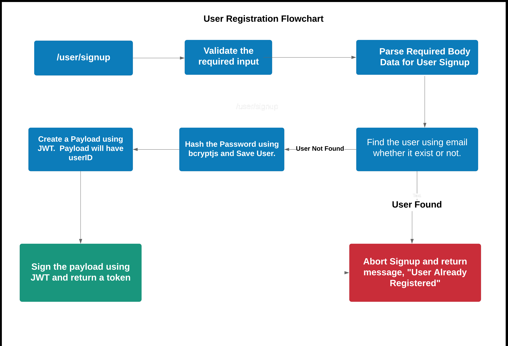

# Flutter Authentication

### Visit My Portfolio : [VIJAI SURIA](https://vijaisuria.github.io)

Fully functional and flexible user authentication application based on token system using 
Flutter for rendering UI and Mongodb along with nodejs for storing the data in backend

## Table of Content 
   * [1. Introduction](#1-introduction) 
   * [2. Prerequisites](#2-prerequisites) 
   * [3. Tools and Packages Required](#3-packages-required)
   * [4. Initiate Project](#4-initiate-project)
   * [5. Setup MongoDB Database](#5-setup-mongodb-database)
   * [6. Setup Android Studio](#6-setup-android-studio)
   * [7. Conclusion](#7-conclusion)

----


### 1. Introduction

User Authentication contains various steps, please checkout this flowchart to know more. We will be using this flow to build authentication system in our application.




----
### 2. Prerequisites

**NodeJs** and **MongoDB** should be installed on your system for Backend.\
**Android Studio** and **Flutter** should be installed on your system for Front-end. You should have prior knowledge of `javascript basics`, `nodejs`, `Dart` and `Flutter`. Knowledge of ES6 syntax is a plus.  

>Installation tutorial links 
- [Flutter Installation](https://www.youtube.com/watch?v=tun0HUHaDuE)
 - [MongoDB setup](https://www.youtube.com/watch?v=XZ4usENdH4s)

----

### 3. Packages Required


You will be needing these following 'npm' packages. 

1. **express**
Express is a minimal and flexible Node.js web application framework that provides a robust set of features for web and mobile applications


2. **nodemon**
Nodemon is a tool that helps develop Node.js based applications by automatically restarting the node application when file changes in the directory are detected

3. **body-parser**
It is `nodejs` middleware for parsing the body data. 


4. **bcryptjs**
This library will be used to hash the password and then store it to database.This way even app administrators can't access the account of a user. 

5. **jsonwebtoken** will be used to encrypt our data payload on registration and return a token. We can use that **token** to authenticate ourselves to secured pages like the dashboard. There would also an option to set the validity of those token, so you can specify how much time that token will last. 

6. **mongoose**
Mongoose is a MongoDB object modeling tool designed to work in an asynchronous environment. Mongoose supports both promises and callbacks.


----

### 4. Initiate Project

We will start by downloading all the depencies by running the following command


```javascript
npm install
```

Now, start the server by running either one of the command

```javascript
npm start    //production mode
npm run dev  //development mode
```

>If you type `npm start` in the terminal, the server will start at PORT 8080, you can change it in the config file. 

----

### 5. Setup MongoDB Database

We will be using MongoDB Database to store our users. You can use either a cloud MongoDB server or a local MongoDB server. 

In this project, we will be using a local MongoDB server.

After successfully installing MongoDB local server on you machine (Recommended: Download MongoDB Compass too :))

Goto MongoDB Compass Dashboard and connect the Database

----

### 6. Setup Android Studio

Make sure that you have no issue in the installion  of flutter and android studio by running this command in powershell or terminal
```bash
flutter doctor
```

Open Android Studion and open (`flutter-auth-master\FE`) the project \
Get the required dependencies and upgrade them by running the command
```bash
flutter pub get
flutter pub upgrade
```
Make sure that you have started the server in background

>Finally open the emulator and run the app !!!

---

### 7. Conclusion


In this Project, we covered authentication in nodejs using **express**, **jsonwebtoken** and MongoDB using Flutter Application. We learned about how to write middleware. 


-----


Check my profile on [LinkedIn](https://linkedin.com/in/vijaisuria) | [Twitter](https://twitter.com/vijaisuria)

If you liked the content, Give a star on repo. And, like the post. 

<br>
